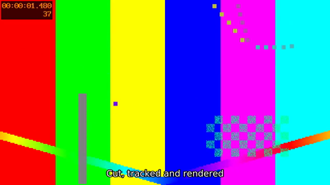
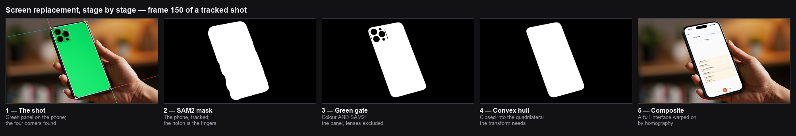

# video-atelier-mcp

An MCP server that gives an agent a video **editing room** — not just a generator.

Most AI video tooling stops at "make me a clip". This one starts after that: it imports the
footage you already have, cuts it, orders the shots, adds captions and an audio bed, replaces the
screen of a filmed phone or laptop with content of your choosing, renders, and exports the result
in every aspect ratio you need. Generation is one optional step among many, behind a replaceable
backend.

It runs as a stdio MCP server in Docker. **No API key is needed** to cut, caption, composite,
render or export.

```bash
git clone <this repo> && cd video-atelier-mcp
mkdir -p work/in && cp /path/to/your/footage/*.mp4 work/in/
docker compose build
```

Then point Claude Code at it:

```json
{
  "mcpServers": {
    "atelier": {
      "command": "docker",
      "args": ["run", "-i", "--rm",
               "-v", "/absolute/path/to/video-atelier-mcp/work:/work",
               "video-atelier-mcp:0.1.0"]
    }
  }
}
```

Ask the agent to `health_check`. It reports ffmpeg, ffprobe, the codecs and filters it found, and
which generation backends are configured.

## What it does

44 tools, in nine families. Everything writes into one mounted work directory, and every output of
the editing tools is registered as a media in its own right — so the id one tool returns is accepted
by the next, and a render can be trimmed, re-composed or exported without touching a path.

The one exception is the `sam2_*` family: it writes to the output path you give it and returns that
path, not an id. Import it with `media_import` if you want to carry it further.

| Family | Tools |
|---|---|
| **media** | `media_import`, `media_list`, `media_probe`, `media_extract_frames`, `media_thumbnail` |
| **timeline** | `comp_create`, `comp_add_clip`, `comp_add_overlay`, `comp_add_transition`, `comp_set_audio_mix`, `comp_get_timeline`, `comp_validate` |
| **cut** | `clip_trim`, `clip_concat`, `clip_speed`, `clip_crop`, `clip_loop`, `clip_format_convert` |
| **captions** | `captions_write_srt`, `captions_burn`, `captions_transcribe` |
| **audio** | `audio_add_track`, `audio_mix`, `audio_extract` |
| **render** | `render_start`, `render_status`, `render_get_output`, `render_cancel`, `render_history` |
| **export** | `export_formats`, `export_gif`, `export_thumbnail_set`, `export_meta` |
| **generate** | `generate_shot`, `generate_status`, `generate_fetch` |
| **screen replacement** | `sam2_segment_image`, `sam2_segment_video`, `sam2_object_track`, `sam2_propagate_mask`, `sam2_refine_mask`, `sam2_screen_replace`, `sam2_video_inpaint` |

Plus `health_check`.

## An end-to-end example

Two rushes in, one captioned 16:9 master and a 9:16 cut out. Every call below was run against the
Docker image; see [examples/end_to_end.md](examples/end_to_end.md) for the full transcript with
real outputs.

```
media_import      source=/work/in/rush1.mp4          -> id 3970f765…
media_import      source=/work/in/rush2.mp4          -> id 57bdc03d…
clip_trim         input=3970f765… start=0.5 duration=2.0
clip_trim         input=57bdc03d… start=1.0 duration=2.0
clip_concat       inputs=[…, …]                      -> one 1920x1080 clip
captions_write_srt segments=[{start,end,text}, …]    -> a .srt
captions_burn     input=… subtitles=…                -> captions in the picture
comp_create       name="demo" width=640 height=360 fps=25
comp_add_clip     comp_id=… media_id=… duration=4.0
render_start      comp_id=…                          -> job_id, state=queued
render_status     job_id=…                           -> persisted state
render_get_output job_id=…                           -> /work/outputs/….mp4
export_formats    input=… format="9:16"              -> 1080x1920
```



## Screen replacement

`sam2_screen_replace` takes a shot of someone holding a phone or sitting at a laptop and puts your
content on the screen, following the perspective as the device moves.

Film the device with a green panel where the screen is. SAM2 is prompted once, on the first frame,
and its mask is propagated across the shot; intersecting a colour gate with that mask isolates the
panel and nothing else — anything interrupting it that is not green, such as the camera lenses,
falls out on its own. The result is closed into a quadrilateral, and a homography warps the
replacement onto it, frame by frame.



These tools need the `sam2` Docker profile — see below. The other 37 tools do not.

## Taking over by hand

The agent builds; you finish. `ui_start` serves the editor the tools write into, on
`127.0.0.1:4321`, and `ui_stop` takes it down.

```
ui_start  ->  { "url": "http://127.0.0.1:4321" }
```

Pick a composition in the sidebar and you get the real thing: video preview, an inspector for the
selected overlay, a timeline with frame thumbnails and audio tracks, rich text with per-run styling,
and the SAM2 tracking panel. What you change is saved straight back into the composition JSON, so
the next agent call sees your edits — and every save keeps a version you can restore.

Text overlays are first-class in the model, not a preview trick: `comp_add_text`, `comp_update_text`
and `comp_remove_text` do from the agent side exactly what the editor does from yours, and
`render_start` burns them in with `drawtext`.

The editor is served from `web-dist/`, which the Docker image builds. Outside the image, build it
once with `cd web && npm ci && npm run build`.

## Dependencies

| What | Where it comes from | Needed for |
|---|---|---|
| ffmpeg, ffprobe | in the base image (Debian) | everything |
| libass + fonts | in the base image | `captions_burn` |
| Whisper CLI | **not** installed (it pulls in torch) | `captions_transcribe` only |
| SAM2 + torch | `sam2` Docker profile | the seven `sam2_*` tools |
| SAM2 checkpoint | downloaded on first use into `/work/models` | the seven `sam2_*` tools |

The SAM2 checkpoint is 2–4 GB. It is deliberately **not** baked into the image: the base image
stays small, and the model is cached in a volume across runs.

The `sam2` image needs two build arguments, and fails loudly without them — it refuses to guess
where to install SAM2 and torch from:

```bash
SAM2_OFFICIAL_GIT_URL=<Meta's SAM2 repository URL> \
TORCH_CPU_INDEX_URL=<the CPU wheel index for your platform> \
  docker compose --profile sam2 build
docker compose --profile sam2 run --rm -T atelier-sam2
```

**This profile has never been built or run.** It is written from the pipeline it was ported from,
not verified end to end, unlike the 37 tools in the base image.

If you call a `sam2_*` tool from the base image, you get a one-line error telling you to use that
profile — not a Python stack trace.

## Generation backends

Generation is chosen per call, on `generate_shot`:

- **`local`** (the default) — takes a rush you already have in the work directory. No key, no cost,
  no network. This is the backend the examples use, and the reason they will still run years from
  now.
- **`azure-sora`** — calls Azure's Sora 2 deployment. Optional, and **dated**: OpenAI retires
  `sora-2` from its API on **24 September 2026**, and the Azure `sora-2` version `2025-12-08` stops
  on **15 October 2026**. Nothing else in the atelier depends on it.

That split is the point of the backend interface: when a generation model goes away, the editing
room does not.

### Costs to expect

Editing, screen replacement and rendering run entirely on your machine: no per-call cost, only CPU
time. The only paid path is the Azure generation backend, billed per generated second by Azure at
their published rates — check the current Azure OpenAI pricing page rather than trusting a figure
quoted here, since the model is being retired and pricing has moved.

## Content and model usage

If you use a generation backend, the resulting footage is model-generated: label it as such where
your audience or platform expects it, and follow the provider's terms (Azure OpenAI for Sora,
Adobe for Firefly). This repository ships no generated content and no third-party footage.

## Limitations

Stated plainly, because they are the difference between a demo and a tool:

- **`comp_add_transition` is a fade to black, not a crossfade.** It does not overlap or shorten
  clips.
- **`render_status` can briefly miss a job that is being written.** Job files are saved by writing
  a temporary file and renaming it; a status call landing in that window sees `ENOENT` instead of
  the job. Observed once in a twelve-call run. Poll again rather than treating it as a failure.
- **An interrupted render restarts from the beginning.** The job is a durable JSON snapshot, so it
  survives a restart, but there is no partial resume.
- **`sam2_video_inpaint` is spatial only** (SAM2 masks plus OpenCV Telea). There is no generative
  model behind it, and no guaranteed temporal consistency between frames.
- **`sam2_propagate_mask` is approximate** — it samples inside/outside points from the mask you
  give it rather than replaying the original prompt.
- **The `sam2` profile has never been built or run**, and the pipeline it was ported from used a
  locally patched build of `sam2` whose provenance could not be established. `Dockerfile.sam2`
  installs Meta's official package (Apache-2.0, as are the `sam2-hiera-small` weights); check that
  it behaves as you need before relying on it.
- **No Remotion bridge.** The editor below covers hand editing; template-driven React rendering
  was left behind on purpose, to keep a browser out of the image.
- **The work directory is trusted.** Paths are confined to it, but there is no sandbox and no SSRF
  filtering on `media_import` URLs. Do not expose this server to untrusted callers.

## How it is built

See [docs/architecture.md](docs/architecture.md): the local JSON store that replaces a database,
the ffmpeg layer (argv, never a shell), the generation backend interface, and the Python bridge
for SAM2.

## License

**PolyForm Noncommercial 1.0.0** — see [LICENSE](LICENSE).

Free for any noncommercial purpose: personal use, study, hobby projects, and use by charities,
schools, public research bodies and government. Commercial use is not granted by this licence —
if you want to use this to make money, contact the author for a commercial licence.

This is a source-available licence, not an OSI-approved open-source one. It is deliberate.

Charities, schools, public research bodies, public safety and health organisations, environmental
organisations and government institutions are covered by the free licence too — the licence says so
explicitly, whatever their funding.

**Commercial licence.** Using this to earn money — including inside a company, for its own internal
work — needs a commercial licence. It is granted, not withheld: write to
**christian@d-fairy.fr**.

Patches are welcome; see [CONTRIBUTING.md](CONTRIBUTING.md), which explains the one grant a
contributor makes so that contributions can ship inside that commercial licence.

Every dependency, its licence, and what the GPL ffmpeg in the Docker image does and does not mean
for your own code: [THIRD-PARTY-NOTICES.md](THIRD-PARTY-NOTICES.md).
